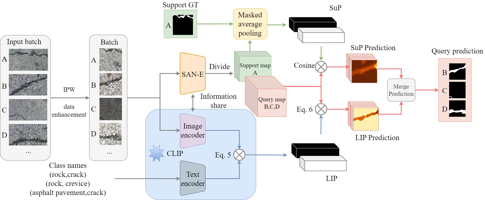

# DPNet-crack

1 Environmental configuration: Refer to the mmsegmentation documentation at https://mmsegmentation.readthedocs.io/zh-cn/latest/get_started.html.

2 Download mmsegmentation and DPNET, and put the DPNET files into the folder with the same name as mmsegmentation.

3 Download the pre-trained files of SAN COCO ViT-B_16 from https://github.com/open-mmlab/mmsegmentation/tree/main/configs/san.

4 Training: Run the command "python tools/train.py ../configs/DPNet/DPNet-crack500.py load_from=../checkpoint/san-vit-b16_20230906-fd0a7684.pth".

5 Testing: Run the command "python tools/test.py ../configs/DPNet/DPNet-crack500.py ${checkpoint}".